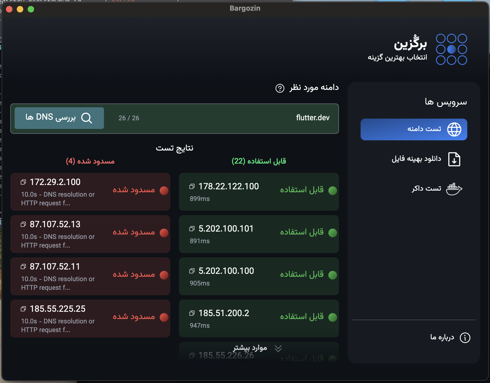

# Bargozin (برگُزین) - DNS & Network Testing Tool

<div align="center">
  
  
  [](https://github.com/Vesal-J/bargozin-desktop/releases)
  [](LICENSE)
  [](https://github.com/Vesal-J/bargozin-desktop/releases)
  [](https://tauri.app/)
  [](https://reactjs.org/)
  [](https://www.rust-lang.org/)
</div>

## 🌟 Overview

**Bargozin** (برگُزین) is a powerful, cross-platform desktop application that helps you test and optimize your network connectivity. It evaluates DNS servers, measures download speeds, and tests Docker registry performance to help you choose the best network configuration for your needs.

### Key Features

- 🌐 **DNS Server Testing**: Test URL accessibility across 26+ DNS servers
- 📊 **Download Speed Analysis**: Measure download performance with different DNS configurations  
- 🐳 **Docker Registry Testing**: Evaluate Docker registry speeds for optimal container workflows
- 🔄 **Real-time Results**: Live progress updates with concurrent testing
- 🌍 **Persian Interface**: Full RTL support with Persian localization
- 💻 **Cross-platform**: Available for Windows, macOS, and Linux
- 🎯 **Session Management**: Reliable test cancellation and result tracking

## 📸 Screenshots

| DNS Testing | Download Speed | Docker Registry |
|-------------|----------------|-----------------|
|  |  |  |

## 🔧 Building from Source

### Prerequisites

- [Rust](https://rustup.rs/) (1.70 or later)
- [Node.js](https://nodejs.org/) (18 or later)
- [Bun](https://bun.sh/) (recommended) or npm/yarn

### Setup

1. **Clone the repository**
   ```bash
   git clone https://github.com/Vesal-J/bargozin-desktop.git
   cd bargozin
   ```

2. **Install dependencies**
   ```bash
   bun install
   ```

3. **Install Tauri CLI**
   ```bash
   cargo install tauri-cli
   ```

4. **Run in development mode**
   ```bash
   bun run tauri dev
   ```

5. **Build for production**
   ```bash
   bun run tauri build
   ```

## 🎯 Usage

### DNS Server Testing

1. **Navigate to the Domain Test tab**
2. **Enter a domain name** (e.g., `google.com`)
3. **Click the search button** to start testing
4. **View results** categorized as:
   - ✅ **Usable**: DNS servers that can resolve the domain
   - ❌ **Unusable**: DNS servers that failed to resolve

### Download Speed Testing

1. **Go to the Download tab**
2. **Enter a download URL** (HTTP/HTTPS)
3. **Set timeout duration** (seconds)
4. **Start the test** to measure speeds across different DNS servers
5. **Compare results** to find the fastest configuration

### Docker Registry Testing

1. **Switch to the Docker tab**
2. **Enter a Docker image name** (e.g., `ubuntu:latest`)
3. **Run the test** to evaluate registry performance
4. **Identify the fastest registry** for your container workflows

## 🏗️ Architecture

```
bargozin/
├── src/                    # React frontend
│   ├── components/         # UI components
│   ├── pages/             # Application pages
│   └── assets/            # Static assets
├── src-tauri/             # Rust backend
│   ├── src/
│   │   ├── commands/      # Tauri commands
│   │   ├── dns/           # DNS testing logic
│   │   ├── docker/        # Docker registry testing
│   │   └── utils/         # Utility functions
│   └── capabilities/      # Security capabilities
└── config/                # Configuration files
```

### Technology Stack

- **Frontend**: React 18, TypeScript, Tailwind CSS
- **Backend**: Rust, Tauri 2.0
- **HTTP Client**: reqwest
- **DNS Resolution**: trust-dns-resolver
- **UI Framework**: React Router, Sonner (notifications)
- **Build Tools**: Vite, Bun

## 🤝 Contributing

We welcome contributions! Please see our [Contributing Guide](CONTRIBUTING.md) for details.

### Development Workflow

1. **Fork the repository**
2. **Create a feature branch** (`git checkout -b feature/amazing-feature`)
3. **Make your changes** and test thoroughly
4. **Commit with conventional commits** (`git commit -m 'feat: add amazing feature'`)
5. **Push to your fork** (`git push origin feature/amazing-feature`)
6. **Open a Pull Request**

### Code Style

- **Rust**: Follow `rustfmt` and `clippy` recommendations
- **TypeScript**: Use ESLint and Prettier configurations
- **Commits**: Follow [Conventional Commits](https://conventionalcommits.org/)

## 🐛 Bug Reports & Feature Requests

- **Bug reports**: [Create an issue](https://github.com/Vesal-J/bargozin-desktop/issues/new?template=bug_report.md)
- **Feature requests**: [Submit a request](https://github.com/Vesal-J/bargozin-desktop/issues/new?template=feature_request.md)

## 📄 License

This project is licensed under the MIT License - see the [LICENSE](LICENSE) file for details.

## 🙏 Acknowledgments

- **Tauri Team**: For the excellent cross-platform framework
- **DNS Providers**: For maintaining reliable DNS infrastructure
- **Open Source Community**: For inspiration and contributions
- **Contributors**: Everyone who helps make Bargozin better

---

<div align="center">
  <strong>Made with ❤️ by the Bargozin Team</strong><br>
  <em>Helping you choose the best network configuration</em>
</div>
